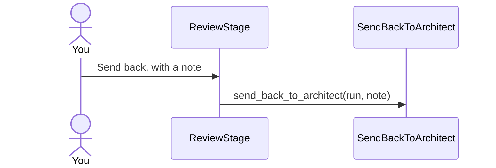

## Implementation plan

### Approach

Sending a task back is a stage move, so it goes through `Rail.Pipeline.Actions.EnterStage`, the only thing that writes `task.stage`.

### Change diagram


### Call flow

From the Send back button to the tasks and runs tables.



### File-level changes

- `lib/rail/pipeline/actions/send_back_to_architect.ex`: New action. Refuses unless the task is at `:review` and idle.
- `lib/rail/pipeline.ex`: Delegates `send_back_to_architect/2` beside `send_to_qa/1`.

### Program design

#### `Rail.Pipeline.Actions.SendBackToArchitect` new

`lib/rail/pipeline/actions/send_back_to_architect.ex`

```elixir
def send_back_to_architect(%Run{} = run, note)
```

#### `Rail.Pipeline`

`lib/rail/pipeline.ex`

```elixir
defdelegate send_back_to_architect(run, note), to: Actions.SendBackToArchitect
```

### Verification

- `lib/rail/pipeline/actions/send_back_to_architect_test.exs` pins the move to `:architect`.

### Assumptions

- The note is required: an empty Send back tells the Architect nothing it can act on.
